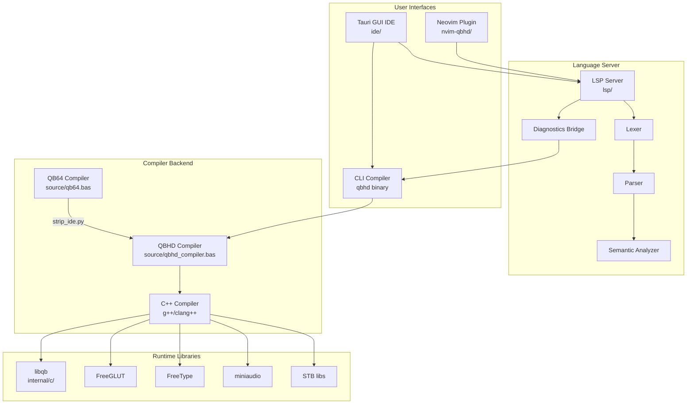
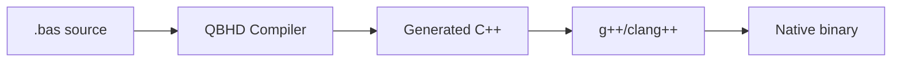
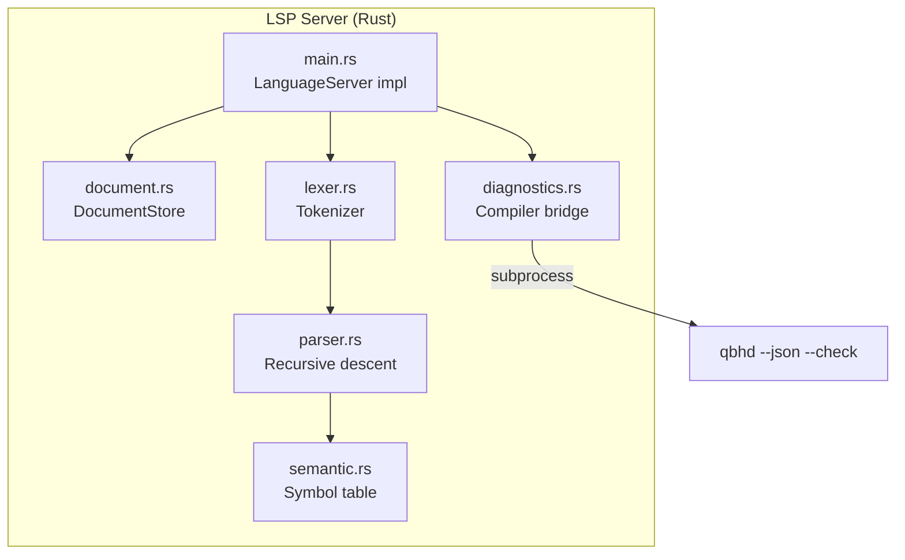
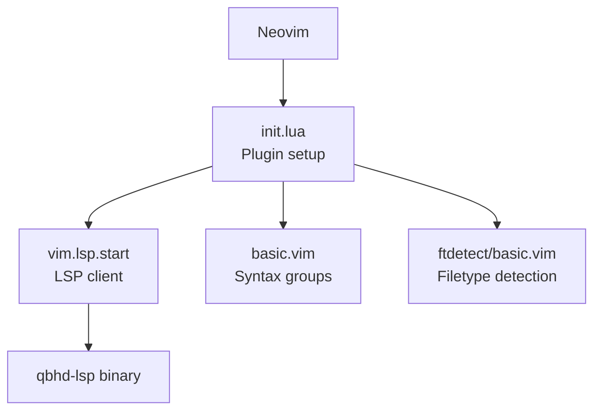
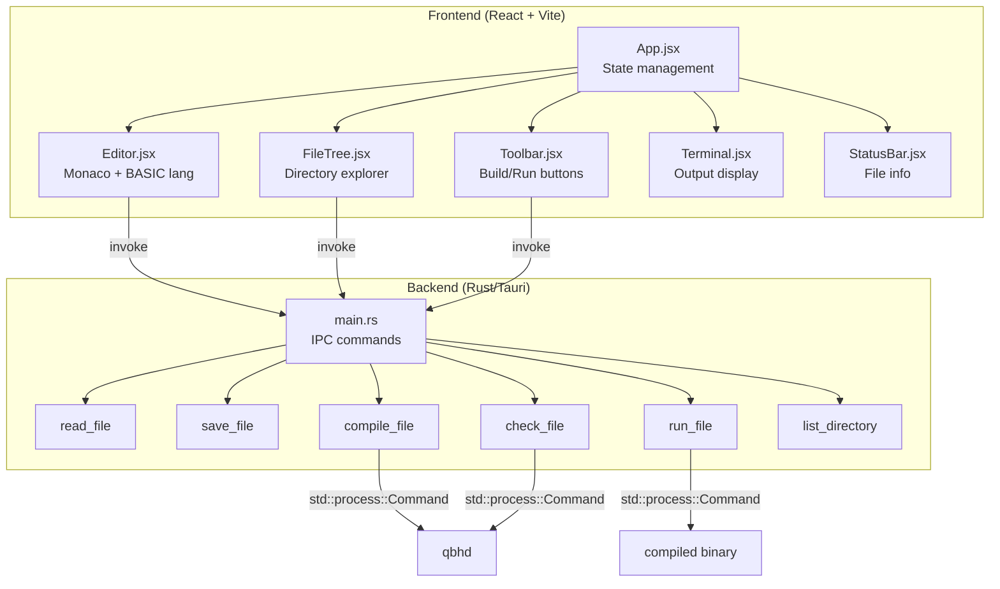
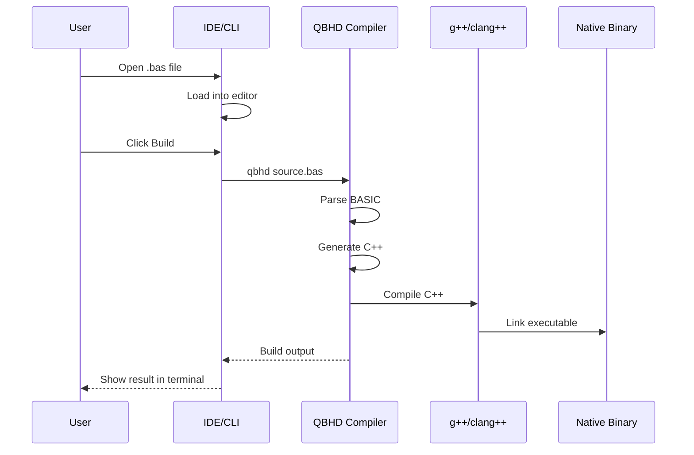
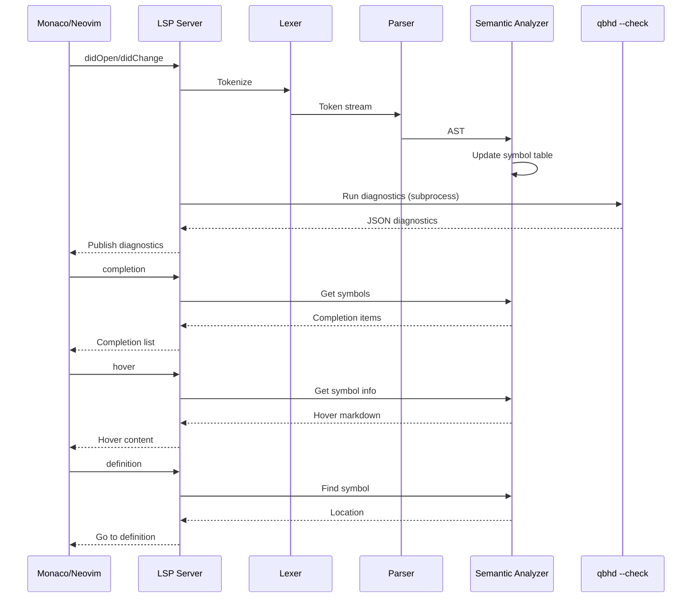
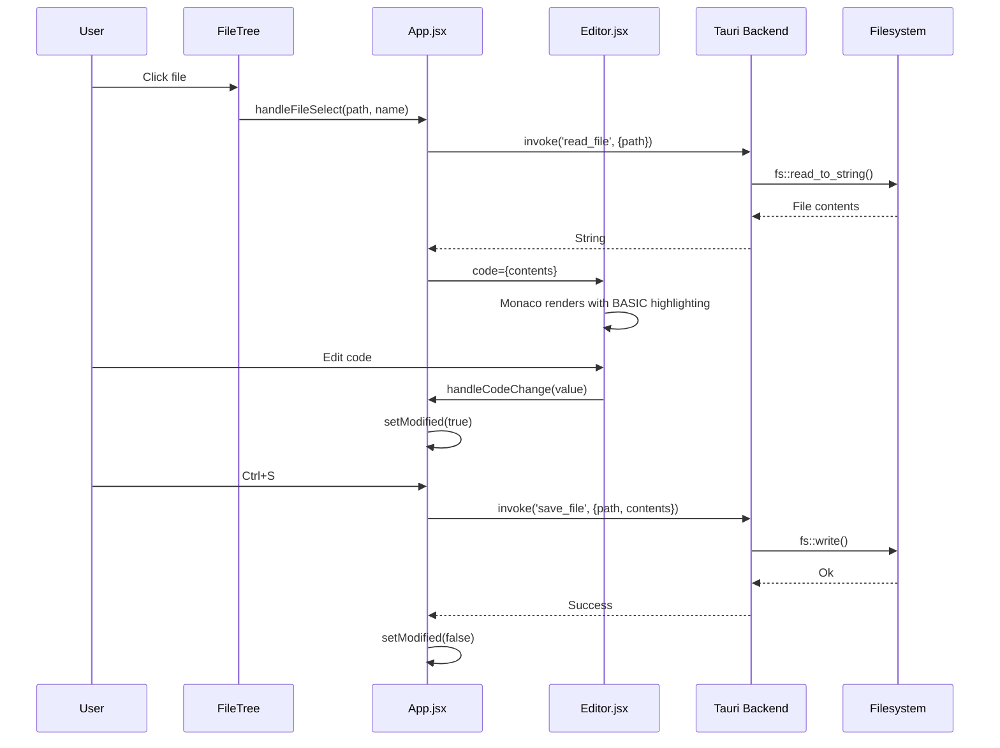
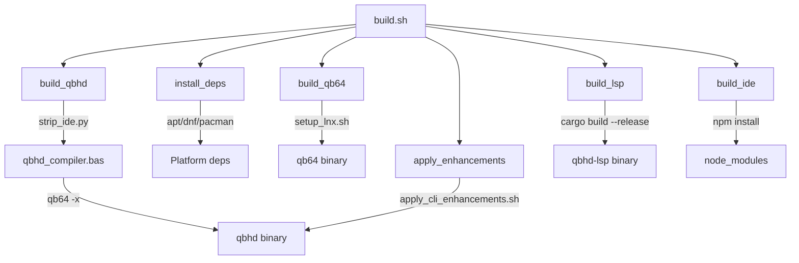

# QBHD Architecture

## Overview

QBHD is a modernized fork of QB64, a BASIC-to-C++ compiler. The original QB64 distribution included a text-mode IDE bundled with the compiler. QBHD strips this IDE and replaces it with three modern frontends: a CLI compiler, a Rust-based Language Server Protocol (LSP) server, and a Tauri-based GUI IDE.



## Component Architecture

### 1. QBHD Compiler

The core compiler is a 26,000-line BASIC program (`source/qbhd_compiler.bas`) that transpiles BASIC source code to C++, which is then compiled to native executables by g++ or clang++.

**Source:** `source/qbhd_compiler.bas` (derived from `source/qb64.bas`)



The compiler is created by `strip_ide.py`, which removes IDE includes from `qb64.bas` and forces compiler-only mode (`NoIDEMode = 1`, `ConsoleMode = 1`).

CLI enhancements (`--json`, `--check`, `--output`, etc.) are injected by `apply_cli_enhancements.sh` via `sed` patching.

### 2. LSP Server (`lsp/`)

A Rust-based Language Server Protocol implementation providing IDE features for BASIC code.



**Key modules:**

| Module | Purpose | Lines |
|--------|---------|-------|
| `main.rs` | LSP protocol handler, request routing | 365 |
| `lexer.rs` | Tokenizer with 130+ keywords | 475 |
| `parser.rs` | Recursive descent parser, Pratt expressions | 830 |
| `semantic.rs` | Symbol table, completions, hover docs | 343 |
| `diagnostics.rs` | Bridges `qbhd --check` to LSP diagnostics | 93 |
| `document.rs` | In-memory document store | 42 |

### 3. Neovim Plugin (`nvim-qbhd/`)

A Lua plugin for Neovim providing LSP integration and BASIC syntax highlighting.



### 4. Tauri GUI IDE (`ide/`)

A desktop IDE built with React 18 (frontend) and Rust/Tauri 1.5 (backend).



## Data Flow

### Compilation Flow



### LSP Request Flow



### IDE File Operation Flow



## State Management

### IDE Frontend State

The IDE uses React's `useState` hooks in `App.jsx`:

| State | Type | Purpose |
|-------|------|---------|
| `currentFile` | `string\|null` | Path to open file |
| `fileName` | `string` | Display name |
| `code` | `string` | Editor content |
| `output` | `string` | Terminal output (appended) |
| `modified` | `boolean` | Unsaved changes flag |
| `cursorPos` | `{line, column}` | Editor cursor |
| `projectDir` | `string` | File tree root |

State flows down via props; callbacks flow up via function props.

### LSP Server State

The LSP server uses `Arc<Mutex<T>>` for shared state:

| State | Type | Purpose |
|-------|------|---------|
| `documents` | `Arc<Mutex<DocumentStore>>` | Open document texts |
| `analyzer` | `Arc<Mutex<SemanticAnalyzer>>` | Symbol table |

## Configuration System

### IDE Configuration

The IDE has no runtime configuration system. All settings are hardcoded:
- Theme: VS Code dark
- Font: Consolas, Courier New
- Port: 1420 (dev server)
- Window: 1200x800, min 800x600

### Compiler Configuration

The QB64/QBHD compiler uses an INI-based configuration system (`source/utilities/ini-manager/`):
- Config file: `internal/config.ini`
- Read/write via `ReadConfigSetting`/`WriteConfigSetting`
- IDE settings in `source/global/IDEsettings.bas`

### Tauri Configuration

`ide/src-tauri/tauri.conf.json`:
- Shell scope: `qbhd`, `qbhd-run`
- Filesystem scope: `["**"]` (unrestricted)
- Dialog: enabled

## Build System



## Security Model

### Current State

The security model is minimal:

1. **Tauri filesystem scope**: `["**"]` -- unrestricted access to the entire filesystem
2. **Tauri shell scope**: Scoped to `qbhd` and `qbhd-run` commands, but the backend uses `std::process::Command` directly, bypassing the scope
3. **No input validation**: File paths from the frontend are passed directly to `fs::read_to_string` and `Command::new`
4. **No CSP**: The Tauri webview has no Content Security Policy

### Recommendations

1. Restrict filesystem scope to project directories
2. Validate file paths before executing commands
3. Use Tauri's shell API instead of `std::process::Command`
4. Add CSP headers to the webview

## Dependencies

### Rust Dependencies (LSP Server)

| Crate | Version | Purpose |
|-------|---------|---------|
| `tower-lsp` | 0.20 | LSP protocol framework |
| `tokio` | 1 (full) | Async runtime |
| `serde` | 1 | Serialization |
| `serde_json` | 1 | JSON parsing |
| `tracing` | 0.1 | Logging (unused directly) |
| `tracing-subscriber` | 0.3 | Log output |
| `anyhow` | 1 | Error handling (unused) |
| `thiserror` | 1 | Error types (unused) |

### Rust Dependencies (IDE Backend)

| Crate | Version | Purpose |
|-------|---------|---------|
| `tauri` | 1.5 | Desktop app framework |
| `serde` | 1 | Serialization |
| `serde_json` | 1 | JSON (unused) |

### JavaScript Dependencies (IDE Frontend)

| Package | Version | Purpose |
|---------|---------|---------|
| `react` | ^18.2.0 | UI framework |
| `react-dom` | ^18.2.0 | DOM rendering |
| `@tauri-apps/api` | ^1.5.0 | Tauri IPC |
| `@monaco-editor/react` | ^4.6.0 | Code editor |
| `vite` | ^5.0.0 | Build tool |
| `@vitejs/plugin-react` | ^4.2.0 | React plugin |
| `@tauri-apps/cli` | ^1.5.0 | Tauri CLI |

### C/C++ Dependencies (Runtime)

| Library | Purpose |
|---------|---------|
| libqb | QB64 runtime core |
| FreeGLUT | OpenGL windowing |
| FreeType | Font rendering |
| miniaudio | Audio playback |
| STB Image | Image loading |
| STB Vorbis | Audio decoding |
| Libxmp-lite | Module playback |
| TinySoundFont | MIDI synthesis |
| zlib | Compression |
| GLEW | OpenGL extensions |

## File Structure

```
QBHD/
├── source/                    # BASIC compiler source
│   ├── qb64.bas              # Original QB64 source (26,345 lines)
│   ├── qbhd_compiler.bas     # Stripped compiler (26,348 lines)
│   ├── global/               # Global includes
│   │   ├── version.bas       # Version string
│   │   ├── settings.bas      # Debug constant
│   │   ├── constants.bas     # Delimiters, key codes
│   │   └── IDEsettings.bas   # IDE configuration
│   ├── utilities/            # Utility modules
│   │   ├── build.bas         # Build helpers
│   │   ├── config.bas        # Config read/write
│   │   ├── file.bas          # File operations
│   │   ├── strings.bas       # String manipulation
│   │   └── ini-manager/      # INI file library
│   ├── ide/                  # IDE source (stripped)
│   └── subs_functions/       # BASIC subroutines
├── lsp/                       # Rust LSP server
│   ├── Cargo.toml
│   └── src/
│       ├── main.rs           # LSP protocol handler
│       ├── lexer.rs          # BASIC tokenizer
│       ├── parser.rs         # Recursive descent parser
│       ├── semantic.rs       # Symbol table & analysis
│       ├── diagnostics.rs    # Compiler integration
│       └── document.rs       # Document store
├── nvim-qbhd/                 # Neovim plugin
│   ├── lua/qbhd/init.lua    # Plugin setup
│   ├── syntax/basic.vim      # Syntax highlighting
│   └── ftdetect/basic.vim    # Filetype detection
├── ide/                       # Tauri GUI IDE
│   ├── package.json
│   ├── vite.config.js
│   ├── index.html
│   ├── src/
│   │   ├── App.jsx           # Root component
│   │   ├── App.css           # Styles
│   │   ├── main.jsx          # Entry point
│   │   └── components/       # UI components
│   └── src-tauri/
│       ├── Cargo.toml
│       ├── tauri.conf.json
│       └── src/main.rs       # Rust backend
├── internal/                  # QB64 runtime libraries
│   ├── c/                    # C/C++ source
│   │   ├── libqb/            # Core runtime
│   │   └── parts/            # Modular components
│   ├── help/                 # BASIC keyword docs
│   └── temp/                 # Build artifacts
├── .ci/                       # CI/CD scripts
├── .github/                   # GitHub workflows
├── licenses/                  # License files
├── build.sh                   # Unified build script
├── strip_ide.py              # IDE stripping
├── Makefile                   # Build automation
└── *.md                       # Documentation
```

## Known Limitations

1. **No incremental LSP sync**: Full document is re-analyzed on every change
2. **Blocking subprocess calls**: Tauri commands and LSP diagnostics block the UI/runtime
3. **Approximate line numbers in semantic analysis**: Based on statement index, not source lines
4. **No scope tracking**: All symbols in a single flat namespace
5. **Single-line IF not supported**: Parser requires `END IF`
6. **No error recovery**: Parser skips lines on failure
7. **Tracing to stdout**: LSP server's tracing subscriber writes to stdout, which can corrupt the JSON-RPC protocol
